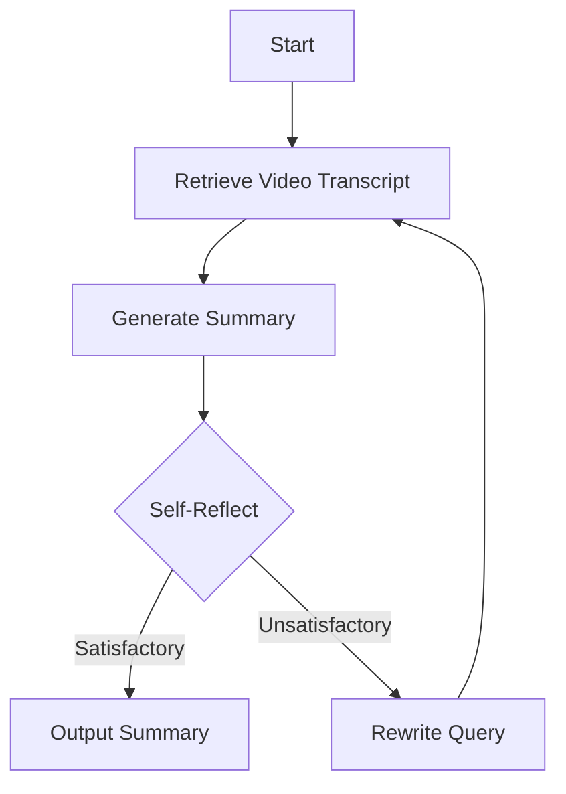

# YouTube Video Summarization Tool Requirements

## Overview
The YouTube Video Summarization Tool is a command-line application that leverages the Anthropic and OpenAI APIs, as well as the YouTube API, to generate summaries for YouTube videos. The tool should support three execution modes: single video, interactive mode, and playlist mode. The resulting summaries will be saved in a specified output folder in Markdown format.

### Technical Specifications
- The application should be developed using the Python programming language.
- The application should utilize the langgraph library for natural language processing tasks, such as summarization.
- The application will implement a Self-Reflective Retrieval Augmented Generation (RAG) approach for summarizing YouTube video content.

The agent graph for the Self-Reflective RAG implementation will have the following structure:

1. **Retrieve Video Transcript**: This node will use the YouTube API to fetch the transcript for the given video.
2. **Generate Summary**: This node will use the LangGraph language model to generate a summary based on the video transcript.
3. **Self-Reflect**: The language model will generate self-reflection tokens to evaluate the quality of the summary.
4. **Output Summary**: If the self-reflection indicates a satisfactory summary, the summary will be output.
5. **Rewrite Query**: If the self-reflection indicates an unsatisfactory summary, the language model will attempt to rewrite the query (video title/description) to improve the retrieval and summary generation process.
6. The process will repeat from the "Retrieve Video Transcript" step with the rewritten query until a satisfactory summary is generated.

This approach allows for an iterative and self-correcting summarization process, leveraging the language model's capabilities for retrieval, generation, and self-evaluation.

This addition explicitly states that we will be implementing the Self-Reflective Retrieval Augmented Generation (RAG) approach for summarizing YouTube video content. It also provides a visual representation of the agent graph design using a Mermaid diagram, explaining the different nodes and the flow of the process.

By including this information in the `Technical Specifications` section, we provide a clear technical overview of the approach and architecture that will be implemented in the application.

This section specifies that the application should be developed in Python and leverage the langgraph library for natural language processing tasks, such as summarization. An example usage of the langgraph library for summarization is also provided to illustrate how it can be integrated into the application.

## Requirements

### 1. Command-Line Interface
The application should be executed from the command line and support the following modes:

#### 1.1. Single Video Mode
- The user should be able to provide a single YouTube video URL as a command-line argument.
- Example: `python summarize.py https://www.youtube.com/watch?v=dQw4w9WgXcQ`

#### 1.2. Interactive Mode
- The application should enter an interactive mode where the user can paste multiple YouTube video URLs.
- The user should be able to exit the interactive mode by entering a specific command (e.g., `exit`).

#### 1.3. Playlist Mode
- The user should be able to provide a YouTube playlist URL as a command-line argument.
- The application should summarize each video in the playlist.

### 2. API Integration
The application should integrate with the following APIs:

#### 2.1. Anthropic API
- The application should use the Anthropic API for natural language processing tasks, such as summarization.
- The Anthropic API key should be loaded from an environment variable.

#### 2.2. OpenAI API
- The application should use the OpenAI API as an alternative or complementary natural language processing service.
- The OpenAI API key should be loaded from an environment variable.

#### 2.3. YouTube API
- The application should use the YouTube API to retrieve video information and transcripts.
- The YouTube API key should be loaded from an environment variable.

### 3. Output
#### 3.1. Output Folder
- The user should be able to specify an output folder path as an environment variable.
- The application should save the generated summaries in Markdown format in the specified output folder.

#### 3.2. Output Format
- The user should be able to specify guidelines for the output format (e.g., summary length, level of detail) as command-line arguments or environment variables.

### 4. Error Handling
- The application should handle errors gracefully and provide informative error messages to the user.
- Appropriate error handling should be implemented for API errors, network errors, and other potential issues.

### 5. Documentation
- The application should include comprehensive documentation, including installation instructions, usage examples, and API documentation.

### 6. Testing
- The application should include a suite of unit tests to ensure the correctness of the core functionality.
- Integration tests should be included to test the API integrations and end-to-end functionality.

### 7. Extensibility
- The application should be designed with extensibility in mind, allowing for future additions or modifications, such as supporting additional APIs or output formats.

### 8. Performance
- The application should be optimized for performance, particularly when summarizing large playlists or long videos.

### 9. Security
- The application should follow best practices for handling API keys and other sensitive information.
- Appropriate measures should be taken to prevent unauthorized access or misuse of the application.

### 10. User Interface
- Although the application is command-line based, consider including a user-friendly interface for better user experience.
- Provide clear instructions and prompts for user input.
- Display progress updates or status messages during the summarization process.

### 11. Logging and Monitoring
- Implement logging mechanisms to track the application's activities, errors, and performance metrics.
- Consider integrating with a logging service or storing logs in a centralized location for easier monitoring and debugging.

### 12. Deployment and Packaging
- Provide instructions for deploying the application in different environments (e.g., development, staging, production).
- Consider packaging the application for easy distribution and installation (e.g., creating an executable, Docker image, or package manager distribution).

### 13. Configuration Management
- Implement a mechanism for managing configuration settings, such as API keys, output folder paths, and output format guidelines.
- Consider using a configuration file or environment variables for easy management and separation of concerns.

### 14. Scalability and Concurrency
- Ensure that the application can handle multiple concurrent requests or summarizations without performance degradation.
- Consider implementing techniques like multithreading, asynchronous programming, or load balancing for better scalability.

### 15. Accessibility
- Ensure that the application adheres to accessibility standards and guidelines, such as providing alternative text for visual elements and supporting screen readers.

### 16. Localization and Internationalization
- If the application needs to support multiple languages or regions, consider implementing localization and internationalization features.
- Provide mechanisms for translating user interface elements, error messages, and documentation.

### 17. Maintenance and Upgradability
- Design the application with maintainability in mind, following best practices for code organization, documentation, and modular design.
- Implement a process for updating and upgrading the application, including handling changes in API specifications or dependencies.

### 18. Compliance and Regulations
- Ensure that the application complies with relevant regulations, such as data privacy laws (e.g., GDPR, CCPA) and terms of service for the APIs used.
- Implement mechanisms for handling user data securely and obtaining necessary permissions or consent.

By including these additional points, the requirements document will be more comprehensive and cover various aspects of the application's development, deployment, and maintenance.